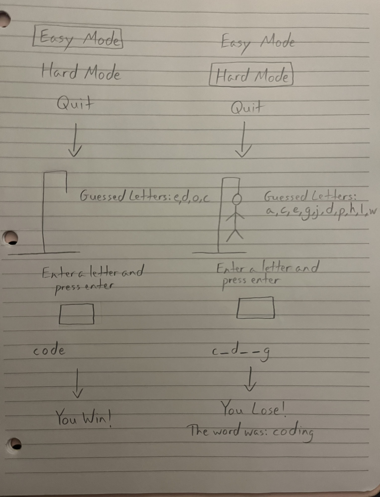

# Hangman Game

## CS110 Final Project  Fall, 2024 

## Team Members

Tianna Balkam

***

## Project Description

This program is an online version of hangman with an easy mode where the user tries to guess a short word and a hard mode where the user tries to guess a longer word.

***    

## GUI Design

### Initial Design

 

### Final Design

## Program Design

### Features

1. main menu to choose difficulty level
2. hangman figure drawing
3. box for user to input letter guesses
4. list keeping track of already guessed letters
5. screen displaying you win or you lose  

### Classes

Hangman Class: 
Manages the core mechanics of the Hangman game, such as selecting a word, processing guesses, checks if the player has won or lost, and draws the hangman figure on the screen.

Game Class:
Manages the game's state, processes player input (guesses), updates the game status, and controls the flow of the game.

Controller Class:
Manages transitions between different screens (main menu, game, win/loss), handles the main menu, and runs the game loop.

## ATP

| Step                 |Procedure             |Expected Results                   |
|----------------------|:--------------------:|----------------------------------:|
|  1                   |click Easy Mode button|Displays screen with image of the  |
|  2                   |                      |gallows and dashes representing a 3-5 letter word|

| Step                 |Procedure             |Expected Results                   |
|----------------------|:--------------------:|----------------------------------:|
|  1                   |Click Hard Mode button|Displays screen with image of the  |
|                      |                      |gallows and dashes representing a 6-8 letter word|

| Step                 |Procedure             |Expected Results                   |
|----------------------|:--------------------:|----------------------------------:|
|  1                   |Click Easy or Hard    |The letter replaces the corresponding|
|                      |Mode button           |dashes or appears in the guessed   |
|  2                   |Click red input box   |letters list                       |
|  3                   |Press any letter key  |                                   |
|                      |and hit enter         |                                   |

| Step                 |Procedure             |Expected Results                   |
|----------------------|:--------------------:|----------------------------------:|
|  1                   |Click Easy or Hard    |Displays screen with message saying|
|                      |Mode button           |"You Lose" and the correct word    |
|  2                   |Guess incorrect letters|                                  |
|                      |until hangman is drawn|                                   |

| Step                 |Procedure             |Expected Results                   |
|----------------------|:--------------------:|----------------------------------:|
|  1                   |Click Easy or Hard    |Displays screen with message saying|
|                      |Mode button           |"You Win"                          |
|  2                   |Guess correct letters |                                   |
|                      |until word is complete|                                   |

## Additional Modules
wonderwords- https://pypi.org/project/wonderwords/