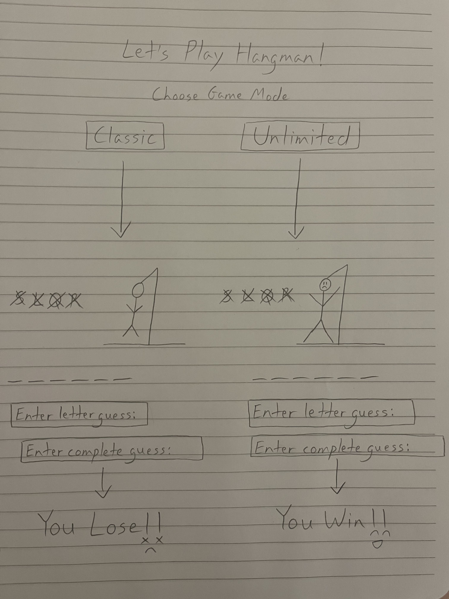

:warning: Everything between << >> needs to be replaced (remove << >> after replacing)

# Hangman Upgrade
## CS110 Final Project  Fall, 2024 

## Team Members

Tianna Balkam

***

## Project Description

I plan to recreate an online version of hangman with an easy mode where the user  has to guess a word and a hard mode where the user has to guess a phrase.

***    

## GUI Design

### Initial Design

 

### Final Design

## Program Design

### Features

1. main menu to choose difficulty level
2. stick figure drawing
3. box for user to input letter guesses
4. list storing incorrect letter guesses
5. screen displaying you win or you lose  

### Classes

- << You should have a list of each of your classes with a description >>

Game Class:
Manage the word to guess and guessed letters.
Track the player's progress (e.g., wrong guesses, win/loss conditions).
Transition between game states (e.g., playing, win, lose).

Hangman Class: 
Manage and create the hangman images.
Update the hangman drawing based on the number of wrong guesses.

## ATP

| Step                 |Procedure             |Expected Results                   |
|----------------------|:--------------------:|----------------------------------:|
|  1                   |click Easy Mode button|GUI window appears with image of a |
|  2                   |                      |gallows and dashes representing a word|

| Step                 |Procedure             |Expected Results                   |
|----------------------|:--------------------:|----------------------------------:|
|  1                   |Click Hard Mode button|GUI window appears with image of a |
|                      |                      |gallows and dashes representing a phrase|

| Step                 |Procedure             |Expected Results                   |
|----------------------|:--------------------:|----------------------------------:|
|  1                   |Click Easy or Hard    |The letter replaces any corresponding|
|                      |Mode button           |dashes or appears in the incorrect |
|  2                   |Press any letter key  |letters box                        |

| Step                 |Procedure             |Expected Results                   |
|----------------------|:--------------------:|----------------------------------:|
|  1                   |Click Easy or Hard    |Display an error message saying to |
|                      |Mode button           |select a valid letter key          |
|  2                   |Press non-letter key  |                                   |

| Step                 |Procedure             |Expected Results                   |
|----------------------|:--------------------:|----------------------------------:|
|  1                   |Click Easy or Hard    |Display screen with message saying |
|                      |Mode button           |"You Lose"                         |
|  2                   |Guess letters until                                       |
|                      |drawing is complete   |                                   |

| Step                 |Procedure             |Expected Results                   |
|----------------------|:--------------------:|----------------------------------:|
|  1                   |Click Easy or Hard    |Display screen with message saying |
|                      |Mode button           |"You Win"                          |
|  2                   |Guess letters until                                       |
|                      |word is complete      |                                   |